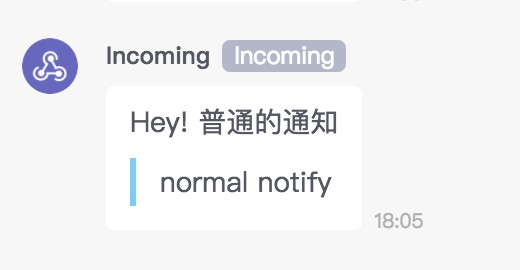
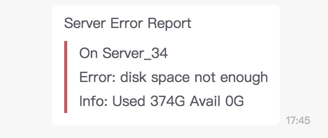

# bearychat-notifier

bearychat-notifier is simpliy incoming bot api client base on [incoming bot](https://ezsync.bearychat.com/dashboard/robots/all/add?type=incoming) with [requests](https://github.com/requests/requests).

## Install

```sh
wget https://raw.githubusercontent.com/3vilive/bearychat-notifier/master/bearychat_notifier.py
```

## Usage

first create your own BearyChatNotifier instance:

```python
from bearychat_notifier import BearyChatNotifier, NotifyLevel

notifier = BearyChatNotifier('your_web_hook_url')
```

notify some message:

```python
notifier.notify(
    title='Hey! 普通的通知',
    text='normal notify',
)
```

then you will got something like this:



notify with warning level:

```python
notifier.notify(
    title='Server Error Report',
    text='On Server_34\nError: disk space not enough\nInfo: Used 374G Avail 0G',
    level=NotifyLevel.Error
)
```

will got:




notify text with url:

```python
notifier.notify(
    title='Analysis completed',
    text='check out on https://url.to.somewhere.com',
    level=NotifyLevel.Success,
)
```

will got:

